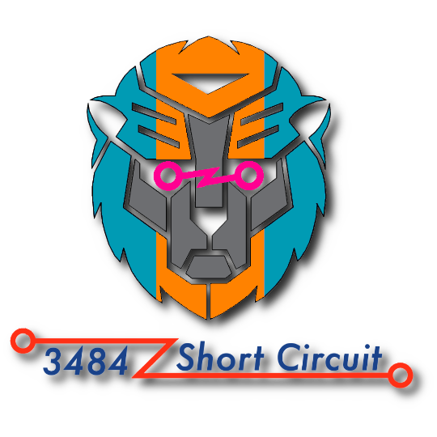

<div align="center">

  

  <h1>2026 Swerve Base</h1>

  **This repository holds 3484's base robot code for the 2026 Rebuilt season**

  **[Branches](https://github.com/FRC-Team3484/SwerveBase/branches)** ● **[Documentation](https://github.com/FRC-Team3484/docs)**

</div>

## Installation
> [!NOTE]
> **This project uses WPILib 2025.3.2 and includes needed vendor dependencies**

First, download the [2025.3.2 Release of WPILib](https://github.com/wpilibsuite/allwpilib/releases/tag/v2025.3.2) and install it to your computer.

Next, clone this repository
```
git clone https://github.com/FRC-Team3484/SwerveBase
```
Now, open the WPILib VSCode that you just installed and navigate to the `SwerveBase` folder. Open the command palette (`Ctrl-Shift-P`) and run the `WPILib: Build Robot Code` command

Source control and WPILib tools and functionality should both be avaliable in this directory

## Documentation
Up to date documentation is avaliable at [FRC-Team3484/docs](https://github.com/FRC-Team3484/docs)